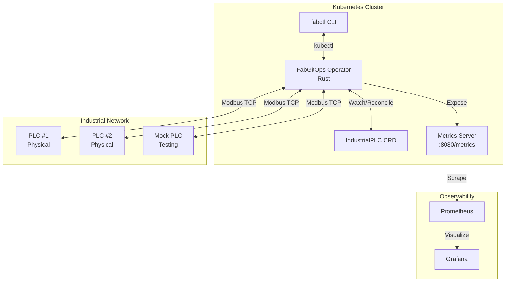

# FabGitOps

> **The Infrastructure Layer** of the Industrial Cloud Stack  
> A Kubernetes Operator for managing Industrial PLCs with GitOps principles

[](./ci-local.sh)
[](LICENSE)

## Overview

FabGitOps is a production-ready Kubernetes operator built in Rust that manages industrial PLCs using GitOps principles. It continuously monitors PLC register values, detects drift from desired state, and automatically corrects deviations.

### Key Features

- 🦀 **Built in Rust** - Zero-cost abstractions, no GC pauses, memory safety
- ⚡ **Real-time Drift Detection** - Polling-based monitoring with configurable intervals
- 🔧 **Auto-Correction** - Automatically fixes drift when detected
- 📊 **Prometheus Metrics** - Full observability with Grafana dashboards
- 🎛️ **CLI Tool (`fabctl`)** - Developer-friendly terminal interface
- 🌀 **Chaos Simulator** - Test drift detection with simulated hardware failures
- ☸️ **Helm Charts** - Production-ready Kubernetes deployment
- 🔄 **Local CI/CD** - Comprehensive local CI script with lint, test, build, and E2E testing
- 🔒 **Security Hardened** - Non-root containers, vulnerability scanning

## Architecture



## Quick Start

### Prerequisites

- [Rust](https://rustup.rs/) (1.75+)
- [Docker](https://docs.docker.com/get-docker/)
- [kubectl](https://kubernetes.io/docs/tasks/tools/)
- [Helm](https://helm.sh/docs/intro/install/)
- A Kubernetes cluster (local with [kind](https://kind.sigs.k8s.io/) or remote)

### Installation

```bash
# Clone the repository
git clone https://github.com/yourusername/fabgitops.git
cd fabgitops

# Build all binaries
cargo build --release --workspace

# Run the demo script
./demo.sh
```

### Quick Demo

```bash
# Run the full interactive demo
./demo.sh

# Or run quick setup without interaction
./demo.sh quick

# Watch live PLC status
./demo.sh watch

# Clean up resources
./demo.sh cleanup
```

## Manual Setup

### 1. Start Observability Stack

```bash
docker-compose up -d
```

- Prometheus: http://localhost:9090
- Grafana: http://localhost:3000 (admin/fabgitops)

### 2. Start Mock PLC (with Chaos Mode)

```bash
# Run locally
./target/release/mock-plc --chaos --chaos-interval 10

# Or via Docker Compose
 docker-compose --profile with-mock-plc up -d
```

### 3. Deploy Operator

```bash
# Apply CRD
kubectl apply -f k8s/crd.yaml

# Apply RBAC
kubectl apply -f k8s/rbac.yaml

# Deploy operator
kubectl apply -f k8s/deployment.yaml

# Or use Helm
helm install fabgitops ./charts/fabgitops
```

### 4. Create a PLC Resource

```bash
kubectl apply -f k8s/sample-plc.yaml
```

### 5. Use fabctl CLI

```bash
# Check status
./target/release/fabctl get-status

# Watch live updates
./target/release/fabctl watch --interval 2

# Trigger manual sync
./target/release/fabctl sync production-line-1 --force

# List all PLCs
./target/release/fabctl list

# Describe a specific PLC
./target/release/fabctl describe production-line-1
```

## CLI Reference

### `fabctl get-status`

Shows the current status of all PLCs in a table format (Git vs Reality).

```bash
./target/release/fabctl get-status
./target/release/fabctl get-status production-line-1
./target/release/fabctl get-status --output json
```

### `fabctl describe`

Shows detailed information about a specific PLC.

```bash
./target/release/fabctl describe production-line-1
```

### `fabctl sync`

Manually triggers reconciliation for a PLC.

```bash
./target/release/fabctl sync production-line-1
./target/release/fabctl sync production-line-1 --force
```

### `fabctl watch`

Continuously monitors PLC status with live updates.

```bash
./target/release/fabctl watch --interval 2
```

### `fabctl list`

Lists all IndustrialPLC resources.

```bash
./target/release/fabctl list
```

### `fabctl version`

Shows version information.

```bash
./target/release/fabctl version
```

## PLC Resource Specification

```yaml
apiVersion: fabgitops.io/v1
kind: IndustrialPLC
metadata:
  name: production-line-1
spec:
  deviceAddress: "192.168.1.100"  # PLC IP address
  port: 502                       # Modbus TCP port (default: 502)
  targetRegister: 4001            # Register to monitor
  targetValue: 2500               # Desired value
  pollIntervalSecs: 5             # Polling interval (default: 5)
  autoCorrect: true               # Auto-correct drift (default: true)
  tags:                           # Optional tags
    - production
    - line-1
```

### Spec Fields

| Field | Type | Default | Description |
|-------|------|---------|-------------|
| `deviceAddress` | string | required | IP address or hostname of the PLC |
| `port` | integer | 502 | Modbus TCP port |
| `targetRegister` | integer | required | Register address to monitor/control |
| `targetValue` | integer | required | Desired value for the register |
| `pollIntervalSecs` | integer | 5 | How often to poll the PLC (seconds) |
| `autoCorrect` | boolean | true | Automatically correct drift when detected |
| `tags` | array | [] | Optional tags for categorization |

### Status Fields

| Field | Description |
|-------|-------------|
| `phase` | Current phase: Pending, Connecting, Connected, DriftDetected, Correcting, Failed |
| `currentValue` | Last read value from the PLC |
| `inSync` | Whether current value matches target |
| `driftEvents` | Total number of drift events detected |
| `correctionsApplied` | Total number of automatic corrections |
| `lastError` | Last error message (if any) |
| `message` | Human-readable status message |
| `lastUpdate` | Timestamp of last status update |

## Metrics

The operator exposes Prometheus metrics at `:8080/metrics`:

| Metric | Type | Description |
|--------|------|-------------|
| `drift_events_total` | Counter | Total drift events detected |
| `corrections_total` | Counter | Total corrections applied |
| `managed_plcs` | Gauge | Number of PLCs being managed |
| `plc_connection_status` | Gauge | PLC connection status (1=connected, 0=disconnected) |
| `register_value` | Gauge | Current register value |
| `reconciliation_duration_seconds` | Gauge | Reconciliation loop duration |

## Project Structure

```
fabgitops/
├── Cargo.toml                    # Workspace root
├── Cargo.lock                    # Dependency lock file
├── docker-compose.yml            # Prometheus + Grafana + Mock PLC
├── prometheus.yml                # Prometheus config
├── demo.sh                       # Interactive demo script
├── Dockerfile.operator           # Operator container image
├── Dockerfile.mock-plc           # Mock PLC container image
├── charts/                       # Helm charts
│   └── fabgitops/
│       ├── Chart.yaml
│       ├── values.yaml
│       └── templates/
│           ├── deployment.yaml
│           ├── rbac.yaml
│           ├── service.yaml
│           ├── serviceaccount.yaml
│           ├── servicemonitor.yaml
│           ├── dashboard-configmap.yaml
│           ├── crd.yaml
│           └── _helpers.tpl
├── crates/
│   ├── operator/                 # Kubernetes Operator (Rust)
│   │   ├── Cargo.toml
│   │   └── src/
│   │       ├── main.rs           # Entry point
│   │       ├── lib.rs            # Library exports
│   │       ├── crd.rs            # IndustrialPLC CRD definition
│   │       ├── controller.rs     # Reconciliation loop
│   │       ├── metrics.rs        # Prometheus metrics
│   │       └── plc_client.rs     # Modbus TCP client
│   │
│   ├── fabctl/                   # CLI Tool
│   │   ├── Cargo.toml
│   │   └── src/
│   │       ├── main.rs           # Entry point
│   │       ├── commands.rs       # CLI commands
│   │       ├── output.rs         # Pretty table formatting
│   │       └── k8s_client.rs     # Kubernetes client
│   │
│   └── mock-plc/                 # Chaos Simulator
│       ├── Cargo.toml
│       └── src/
│           ├── main.rs           # Entry point
│           ├── server.rs         # Modbus TCP server
│           └── chaos.rs          # Chaos mode implementation
│
├── k8s/                          # Raw K8s manifests (for dev)
│   ├── crd.yaml                  # Custom Resource Definition
│   ├── rbac.yaml                 # RBAC permissions
│   ├── deployment.yaml           # Operator deployment
│   ├── deployment-local.yaml     # Local development deployment
│   ├── mock-plc.yaml             # Mock PLC deployment
│   └── sample-plc.yaml           # Sample PLC resources
│
├── ci-local.sh                   # Local CI/CD script
│
├── docs/
│   ├── adr/                      # Architecture Decision Records
│   │   ├── 001-why-rust-operator.md
│   │   └── 002-modbus-tcp-strategy.md
│   ├── grafana-dashboards/       # Grafana dashboard configs
│   │   ├── dashboard.yml
│   │   └── fabgitops-dashboard.json
│   └── grafana-datasources/      # Grafana datasource configs
│       └── datasource.yml
│
└── README.md                     # This file
```

## Development

### Running Tests

```bash
# Run all tests
cargo test --workspace

# Run with logging
RUST_LOG=debug cargo test --workspace -- --nocapture

# Run specific crate tests
cargo test -p operator
cargo test -p fabctl
cargo test -p mock-plc
```

### Building Docker Images

```bash
# Build operator image
docker build -f Dockerfile.operator -t fabgitops-operator:latest .

# Build mock-plc image
docker build -f Dockerfile.mock-plc -t fabgitops-mock-plc:latest .
```

Or use the CI script:
```bash
./ci-local.sh
```

### Running Locally

```bash
# Start the operator (requires kubectl configured)
cargo run -p operator

# Start mock-plc
cargo run -p mock-plc -- --chaos

# Use fabctl
cargo run -p fabctl -- get-status
```

## Architecture Decision Records

See [docs/adr/](docs/adr/) for detailed architecture decisions:

- [ADR 001: Why Rust for the Operator](docs/adr/001-why-rust-operator.md) - Safety, no GC pauses, memory safety
- [ADR 002: Modbus TCP Polling Strategy](docs/adr/002-modbus-tcp-strategy.md) - Polling vs interrupts for legacy hardware

## CI/CD Pipeline

The project uses a local CI script (`ci-local.sh`) that replicates a full CI/CD pipeline:

1. **Lint & Test** - `cargo fmt`, `cargo clippy`, `cargo test`
2. **Build Images** - Docker images for operator and mock-plc
3. **Helm Lint** - Chart validation and templating
4. **Security Scan** - Trivy vulnerability scanning (optional)
5. **E2E Test** - Kind cluster with Helm deployment and validation (optional)

### Running CI Locally

```bash
# Run basic checks (lint, test, build, helm)
./ci-local.sh

# Run with security scan
./ci-local.sh --security

# Run with E2E tests (requires Kind)
./ci-local.sh --e2e

# Run all checks
./ci-local.sh --all
```

## Troubleshooting

### Operator won't start

```bash
# Check logs
kubectl logs deployment/fabgitops-operator

# Check if CRD is installed
kubectl get crd industrialplcs.fabgitops.io

# Check RBAC permissions
kubectl auth can-i list industrialplcs --as=system:serviceaccount:default:fabgitops-operator
```

### PLC shows as Failed

```bash
# Check PLC connectivity
kubectl describe industrialplc production-line-1

# Check operator logs
kubectl logs deployment/fabgitops-operator | grep -i error

# Check Kubernetes events
kubectl get events --field-selector involvedObject.kind=IndustrialPLC
```

### Metrics not showing in Grafana

```bash
# Check Prometheus targets
curl http://localhost:9090/api/v1/targets

# Check operator metrics endpoint
kubectl port-forward svc/fabgitops-operator-metrics 8080:8080
curl http://localhost:8080/metrics

# Verify ServiceMonitor (if using Prometheus Operator)
kubectl get servicemonitor
```

### Mock PLC connection issues

```bash
# Check if mock-plc is running
lsof -i :5502

# Test Modbus connection
cargo run -p fabctl -- get-status

# Check mock-plc logs
pkill -f mock-plc && cargo run -p mock-plc -- --chaos
```

## Contributing

1. Fork the repository
2. Create your feature branch (`git checkout -b feature/amazing-feature`)
3. Commit your changes (`git commit -m 'Add amazing feature'`)
4. Push to the branch (`git push origin feature/amazing-feature`)
5. Open a Pull Request

## License

This project is licensed under the MIT License - see the [LICENSE](LICENSE) file for details.

## Acknowledgments

- [kube-rs](https://github.com/kube-rs/kube-rs) - Kubernetes client for Rust
- [tokio-modbus](https://github.com/slowtec/tokio-modbus) - Modbus TCP library
- [clap](https://github.com/clap-rs/clap) - Command line argument parser
- [axum](https://github.com/tokio-rs/axum) - Web framework for metrics endpoint

---

**FabGitOps** - The Infrastructure Layer of Your Industrial Cloud Stack
