# FabGitOps Architecture

This document provides a comprehensive overview of the FabGitOps system architecture, design patterns, and implementation details.

## Table of Contents

1. [System Overview](#system-overview)
2. [Architecture Components](#architecture-components)
3. [Data Flow](#data-flow)
4. [Design Patterns](#design-patterns)
5. [Security Model](#security-model)
6. [Observability](#observability)
7. [Deployment Architecture](#deployment-architecture)
8. [Technology Stack](#technology-stack)

## System Overview

FabGitOps is a Kubernetes operator that implements GitOps principles for managing industrial PLCs (Programmable Logic Controllers). It bridges the gap between modern cloud-native infrastructure and legacy industrial hardware.

### Core Philosophy

- **GitOps-First**: Desired state is declared in Git and applied via Kubernetes
- **Continuous Reconciliation**: The operator continuously monitors and corrects drift
- **Observability by Design**: Every action is observable via metrics and events
- **Safety Critical**: Built for industrial environments where reliability is paramount

### High-Level Architecture


## Architecture Components

### 1. Kubernetes Operator

The operator is the core of FabGitOps, built using the [kube-rs](https://github.com/kube-rs/kube-rs) framework.

#### Controller Loop

```rust
// Simplified reconciliation flow
loop {
    1. Watch for IndustrialPLC resource changes
    2. Connect to PLC via Modbus TCP
    3. Read current register value
    4. Compare with desired (target) value
    5. If drift detected:
       - Record metrics
       - Emit Kubernetes event
       - If autoCorrect: write target value
    6. Update status subresource
    7. Requeue after pollIntervalSecs
}
```

#### Key Components

| Component | Responsibility | File |
|-----------|---------------|------|
| `Controller` | Reconciliation loop, drift detection, correction | `controller.rs` |
| `CRD` | IndustrialPLC resource definition | `crd.rs` |
| `PLCClient` | Modbus TCP communication | `plc_client.rs` |
| `Metrics` | Prometheus metrics collection | `metrics.rs` |

### 2. Custom Resource Definition (CRD)

The `IndustrialPLC` CRD defines the desired state of a PLC:

```yaml
apiVersion: fabgitops.io/v1
kind: IndustrialPLC
spec:
  deviceAddress: "192.168.1.100"    # Network location
  port: 502                         # Modbus TCP port
  targetRegister: 4001              # Register to control
  targetValue: 2500                 # Desired value
  pollIntervalSecs: 5               # Reconciliation frequency
  autoCorrect: true                 # Enable drift correction
status:
  phase: Connected                  # Current state machine phase
  currentValue: 2500                # Last read value
  inSync: true                      # Sync status
  driftEvents: 3                    # Total drift count
  correctionsApplied: 3             # Total corrections
```

#### State Machine


### 3. PLC Client

The Modbus TCP client handles communication with industrial hardware:

- **Protocol**: Modbus TCP (RFC 793)
- **Operations**: Read Holding Registers (FC 03), Write Single Register (FC 06)
- **Connection**: Short-lived connections per operation
- **Timeout**: Configurable per PLC resource

### 4. fabctl CLI

A developer-friendly CLI for interacting with the system:

| Command | Description |
|---------|-------------|
| `get-status` | Show Git vs Reality table |
| `describe` | Detailed PLC information |
| `sync` | Trigger manual reconciliation |
| `watch` | Live dashboard with auto-refresh |
| `list` | List all managed PLCs |
| `version` | Show version information |

### 5. Mock PLC

A testing tool that simulates industrial PLCs:

- **Modbus TCP Server**: Responds to read/write requests
- **Chaos Mode**: Randomly drifts register values to test drift detection
- **Configurable**: Bind address, port, initial value, drift interval

## Data Flow

### Normal Operation Flow


### Drift Detection Flow

```mermaid
flowchart LR
    subgraph Git[Git - Desired]
        TV[targetValue: 2500]
    end
    
    subgraph Reality[Reality - Actual]
        CV[currentValue: 2400]
    end
    
    subgraph Action[Operator Action]
        A1[1. Record drift]
        A2[2. Emit event]
        A3[3. Write 2500]
        A4[4. Update status]
    end
    
    TV -->|≠| CV
    CV --> A1
    A1 --> A2
    A2 --> A3
    A3 --> A4
```



## Design Patterns

### 1. Operator Pattern

The Kubernetes Operator pattern automates operations tasks:

- **Custom Resource**: IndustrialPLC defines desired state
- **Controller**: Continuously reconciles actual state with desired
- **Status Subresource**: Reflects current system state

### 2. Circuit Breaker

Prevents cascading failures during PLC communication issues:

```rust
match plc_client.read_register(register).await {
    Ok(value) => {
        failures = 0;
        // Process value
    }
    Err(e) => {
        failures += 1;
        let backoff = min(2_u64.pow(failures), 60);
        // Requeue with exponential backoff
    }
}
```

### 3. Observer Pattern

Kubernetes events notify users of significant occurrences:

- `DriftDetected`: Warning when register value deviates
- `DriftCorrected`: Normal event when correction applied
- `ConnectionFailed`: Warning when PLC unreachable

### 4. Strategy Pattern

Different behaviors based on configuration:

- **Auto-correct**: Enabled/disabled per PLC
- **Polling intervals**: Configurable per device
- **Output formats**: Table, JSON, YAML in CLI

### 5. Sidecar Pattern (Metrics)

The operator exposes metrics via a built-in HTTP server:


## Security Model

### RBAC Configuration

The operator uses least-privilege RBAC:

```yaml
rules:
  # Manage IndustrialPLC resources
  - apiGroups: [fabgitops.io]
    resources: [industrialplcs]
    verbs: [get, list, watch, create, update, patch, delete]
  
  # Update status subresource
  - apiGroups: [fabgitops.io]
    resources: [industrialplcs/status]
    verbs: [get, update, patch]
  
  # Emit events
  - apiGroups: [""]
    resources: [events]
    verbs: [create, patch]
```

### Container Security

```dockerfile
# Non-root user
USER fabgitops

# Read-only root filesystem
readOnlyRootFilesystem: true

# Drop all capabilities
capabilities:
  drop: [ALL]

# No privilege escalation
allowPrivilegeEscalation: false
```

### Network Security

- **No external exposure**: Operator metrics only via ClusterIP
- **Network policies**: Can be applied to restrict PLC network access
- **TLS**: Modbus TCP is unencrypted by protocol; consider VPN for remote PLCs

## Observability

### Metrics

| Metric | Type | Labels | Description |
|--------|------|--------|-------------|
| `drift_events_total` | Counter | plc_name, namespace | Total drift detections |
| `corrections_total` | Counter | plc_name, namespace | Total successful corrections |
| `managed_plcs` | Gauge | - | Number of PLCs managed |
| `plc_connection_status` | Gauge | plc_name, namespace | Connection state (1/0) |
| `register_value` | Gauge | plc_name, namespace, register | Current register value |
| `reconciliation_duration_seconds` | Gauge | - | Reconciliation time |

### Logging

Structured logging with tracing:

```
INFO  Reconciling PLC: default/production-line-1
INFO  PLC default/production-line-1 is reachable
INFO  Register 4001 current value: 2400, desired: 2500
WARN  Drift detected! Applying correction...
INFO  Corrected register 4001 to 2500
```

### Events

Kubernetes events provide user-visible notifications:

```bash
$ kubectl get events
LAST SEEN   TYPE      REASON           OBJECT
10s         Warning   DriftDetected    industrialplc/production-line-1
5s          Normal    DriftCorrected   industrialplc/production-line-1
```

### Grafana Dashboard

Pre-configured dashboard showing:
- Drift events over time
- Correction success rate
- PLC connection status
- Register value trends
- Reconciliation latency

## CI/CD Pipeline

The project uses a local CI script (`ci-local.sh`) instead of GitHub Actions for greater flexibility and local testing:

### Pipeline Phases

| Phase | Description | Optional |
|-------|-------------|----------|
| 1. Prerequisites | Check cargo, docker, helm, kubectl | No |
| 2. Lint & Test | cargo fmt, clippy, test | No |
| 3. Build Images | Docker build for operator and mock-plc | No |
| 4. Helm Validation | helm lint, helm template | No |
| 5. Security Scan | Trivy vulnerability scan | Yes |
| 6. E2E Test | Kind cluster, deploy, verify | Yes |

### Usage

```bash
# Basic checks (phases 1-4)
./ci-local.sh

# With E2E tests (requires Kind)
./ci-local.sh --e2e

# With security scan (requires Trivy)
./ci-local.sh --security

# Run all checks
./ci-local.sh --all
```

## Deployment Architecture

### Single Cluster


### Multi-Zone (Production)


## Technology Stack

### Core Technologies

| Layer | Technology | Purpose |
|-------|------------|---------|
| Language | Rust 2021 | Systems programming |
| Async Runtime | Tokio | Async I/O and scheduling |
| Kubernetes | kube-rs | K8s client and operator framework |
| Protocol | tokio-modbus | Modbus TCP communication |
| Metrics | prometheus | Metrics collection |
| HTTP | axum | Metrics endpoint |
| CLI | clap | Command-line parsing |
| Serialization | serde | JSON/YAML handling |

### Infrastructure

| Component | Technology |
|-----------|------------|
| Container Runtime | Docker |
| Orchestration | Kubernetes |
| Package Manager | Helm 3 |
| CI/CD | Local CI Script (`ci-local.sh`) |
| Registry | GitHub Container Registry |
| Monitoring | Prometheus |
| Visualization | Grafana |

### Development Tools

| Tool | Purpose |
|------|---------|
| cargo | Build and dependency management |
| clippy | Linting |
| rustfmt | Code formatting |
| kind | Local K8s testing for E2E |
| kubectl | K8s CLI |
| helm | Package management |

## Performance Characteristics

### Resource Usage

| Component | CPU | Memory | Notes |
|-----------|-----|--------|-------|
| Operator | 100m-500m | 128Mi-256Mi | Per replica |
| fabctl | Minimal | Minimal | CLI tool |
| Mock PLC | 50m | 64Mi | Testing only |

### Scalability

- **PLCs per Operator**: Tested with 100+ PLCs
- **Reconciliation Latency**: < 100ms per PLC (typical)
- **Metrics Scrape**: < 10ms response time
- **Memory Growth**: Linear with PLC count (~1KB per PLC)

### Reliability

- **Crash Recovery**: Automatic on restart
- **Network Partitions**: Exponential backoff retry
- **PLC Failures**: Isolated per PLC resource
- **Zero-Downtime Deploy**: Rolling update support

## Future Considerations

### Potential Enhancements

1. **Webhook Validation**: Admission webhooks for CRD validation
2. **Leader Election**: Multi-replica operator with leader election
3. **Protocol Extensions**: Support for OPC-UA, EtherNet/IP
4. **Alerting**: Prometheus Alertmanager integration
5. **Backup/Restore**: Velero integration for CRD backup
6. **Multi-Cluster**: Fleet management across clusters

### Known Limitations

1. **Modbus TCP Only**: No serial (RTU/ASCII) support
2. **Single Register**: Per-PLC resource (no batch operations)
3. **No Authentication**: Modbus protocol limitation
4. **Polling Only**: No interrupt-driven updates

---

*For more details, see the [Architecture Decision Records](adr/) directory.*
